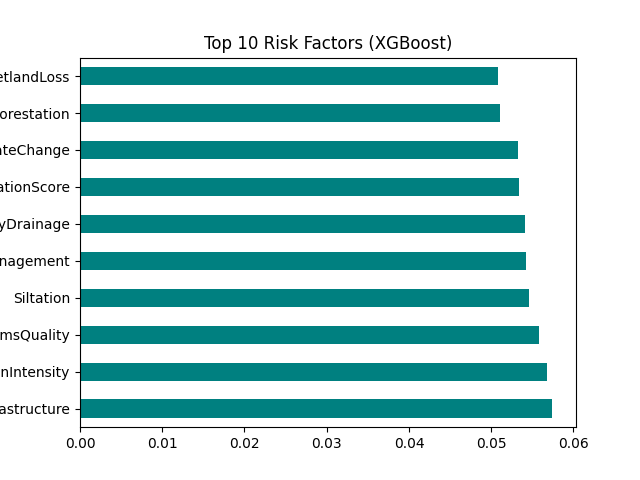

# 🌊 FloodGuard AI - Intelligent Flood Prediction & Alert System

[](https://www.python.org/)
[](https://fastapi.tiangolo.com/)
[](https://reactjs.org/)
[](https://expo.dev/)

**FloodGuard AI** is a comprehensive, multi-platform solution designed to predict flood probabilities with high accuracy and provide real-time alerts to mitigate disaster impact. Leveraging advanced Machine Learning models and a modern web/mobile stack, it offers a robust tool for disaster preparedness.

---

## 🚀 Key Features

- **🤖 AI-Driven Prediction**: Analyzes 20 critical environmental factors (Monsoon Intensity, Topography, Urbanization, etc.) using an **Ensemble Model** (Random Forest + XGBoost).
- **🚨 Real-time Alerts**: Automated email notification system triggered by high-risk predictions.
- **🌐 Interactive Dashboards**: 
    - **Main Dashboard**: Real-time stats and prediction controls built with React.
    - **3D Visualization**: Immersive Three.js environment for spatial flood impact analysis.
- **📱 Mobile App**: Expo-powered mobile interface for on-the-go monitoring and alerts.
- **📊 Data Analysis**: Deep insights into historical Indian rainfall and flood patterns with automated feature importance visualization.
- **⚡ High Performance**: Fast and scalable API built with FastAPI.


*Top 10 Risk Factors analyzed by the XGBoost Model.*

---

## 🛠️ Tech Stack

### Backend & ML
- **Language**: Python 3.8+
- **Framework**: FastAPI
- **ML Libraries**: Scikit-learn, XGBoost, Pandas, Numpy, Joblib
- **Task Management**: BackgroundTasks for async alerting

### Frontend
- **Web**: React.js (Vite), Tailwind CSS, Lucide Icons
- **3D**: Three.js
- **Mobile**: React Native (Expo)

### Data Sources
- **Datasets**: Indian Rainfall (1901-2015), Regional Flood Data (Kaggle).
- **APIs**: OpenWeather API (Integration planned/partial).

---

## 📂 Project Structure

```text
├── 3d_website/         # 3D Immersive Web Interface (Three.js)
├── frontend/           # React Web Application (Vite + Tailwind)
├── mobile_app/         # Expo React Native App
├── models/             # Trained ML Models (Joblib/PKL)
├── static/             # Static Assets & CSS
├── main.py             # FastAPI Backend Server & Prediction Logic
├── train_advanced_model.py # Advanced Ensemble Training Script
├── requirements.txt    # Python Dependencies
└── README.md           # Project Documentation
```

---

## ⚙️ Installation & Setup

### 1. Prerequisites
- Python 3.8+
- Node.js & npm
- Expo Go (for mobile testing)

### 2. Backend Setup
```bash
# Clone the repository
git clone https://github.com/anshu1209ol/FloodGuardAi.git
cd FloodGuardAi

# Create virtual environment
python -m venv .venv
source .venv/bin/activate  # Windows: .venv\Scripts\activate

# Install dependencies
pip install -r requirements.txt

# Set up environment variables (.env)
# Create a .env file in the root with:
# OPENWEATHER_API_KEY=your_key_here

# Start the server
python main.py
```

### 3. Frontend Setup
```bash
cd frontend
npm install
npm run dev
```

### 4. Mobile App Setup
```bash
cd mobile_app
npm install
npx expo start
```

---

## 📊 How It Works

1. **Data Ingestion**: The system processes 20 environmental parameters.
2. **ML Logic**: 
    - Uses a pre-trained **XGBoost Regressor** for core predictions.
    - Features are normalized using `StandardScaler`.
    - Handles missing values via `SimpleImputer` (median strategy).
3. **Output**: Returns a probability score (0.0 - 1.0).
4. **Alerting Workflow**: 
    - `Low Risk (<0.4)`: Safe status (Green).
    - `Moderate Risk (0.4 - 0.7)`: Advisory warning (Yellow).
    - `High Risk (>0.7)`: Immediate **Email Alert** triggered via background task (Red).

---

## 📝 Roadmap

- [x] Advanced Ensemble ML Model (RF + XGBoost).
- [x] Multi-platform Support (Web + Mobile).
- [ ] SMS/Push Notification integration.
- [ ] Real-time satellite data ingestion.
- [ ] Multi-language support for emergency alerts.

---

## 🤝 Contributing

Contributions are welcome! Please feel free to submit a Pull Request.

1. Fork the Project
2. Create your Feature Branch (`git checkout -b feature/AmazingFeature`)
3. Commit your Changes (`git commit -m 'Add some AmazingFeature'`)
4. Push to the Branch (`git push origin feature/AmazingFeature`)
5. Open a Pull Request

---

## 📄 License

Distributed under the MIT License. See `LICENSE` for more information.

---

**Developed with ❤️ by [Anshu](https://github.com/anshu1209ol)**
